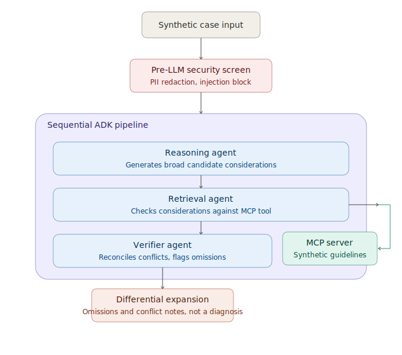

# Differential Co-Pilot

A multi-agent clinical reasoning demo built with Google ADK and MCP for the
**Kaggle AI Agents Intensive Capstone**, Agents for Good track.

> ⚠️ **This is a portfolio demo, not a real clinical tool.** It uses synthetic
> patient data and a synthetic, illustrative reference dataset only. It is
> not connected to any real guideline database and must never be used for
> actual medical decisions.

## The problem

Clinical decision-support tools risk a specific failure mode: narrowing too
fast. A single model asked "what's wrong with this patient" tends to commit
to a likely answer and quietly drop plausible alternatives, exactly the
moment a clinician most needs to be reminded of what they might be missing.

Differential Co-Pilot explores a different shape for this problem: instead
of one model producing one answer, three agents with distinct, narrow jobs
work in sequence, and the system's output is explicitly framed as a set of
**considerations for clinician review**, never a diagnosis. The system's job
is *omission prevention*, not narrowing.

## The solution

A clinician (or in this demo, anyone) enters a short synthetic case. The
case passes through a security screen, then a three-agent pipeline, and the
result is a **differential expansion**: a reconciled list of clinical
considerations, an explicit list of flagged omissions, and a record of
where the agents disagreed and how that was resolved.

That last part, conflict notes, is the contestability layer. The system
never hands back a black-box answer. It shows its work well enough that a
clinician could push back on it.

## Architecture



**1. Pre-LLM security screen** (`agents/security_screen.py`)
Runs before any agent or LLM call. Two jobs: redact PII patterns (emails,
phone numbers, SSNs, MRNs, name labels) so they never reach a model call,
and detect prompt-injection patterns, short-circuiting to a blocked state
with explicit reasons rather than silently processing or silently failing.
This is a deliberately simple, rule-based, auditable gate rather than an ML
classifier, a security gate should be predictable, not itself a black box.

**2. Reasoning agent** (`agents/reasoning_agent.py`)
Reads the screened case and generates a deliberately broad set of candidate
considerations across categories (cardiac, pulmonary, musculoskeletal,
psychiatric, other). Its job is to be exploratory, not correct, narrowing
happens downstream.

**3. Retrieval agent** (`agents/retrieval_agent.py`)
Calls an MCP server (`mcp_server/server.py`) exposing a single tool,
`lookup_guidelines`, over a synthetic reference dataset spanning cardiac,
pulmonary, gastrointestinal, neurological, reproductive, infectious, and
endocrine presentations. Maps
supporting and contradicting evidence back onto each consideration from the
Reasoning agent, and is instructed to surface weak or contradicting
evidence explicitly rather than omit it.

**4. Verifier / conflict-resolution agent** (`agents/verifier_agent.py`)
The final, conservative checkpoint. Reconciles the Reasoning and Retrieval
agents' outputs into a final differential expansion, explicitly flags any
consideration that was under-weighted or contradicted but still clinically
plausible, and writes conflict notes describing every place the two
upstream agents disagreed and how it was resolved. Hard-instructed never to
collapse to a single dominant answer.

All three agents are wired as a `SequentialAgent` in `agents/pipeline.py`,
each reading prior agents' output from shared ADK session state.

## Concepts demonstrated

| Concept | Where |
|---|---|
| Multi-agent system (ADK) | `agents/pipeline.py`, `agents/*_agent.py` — three-agent `SequentialAgent` |
| MCP server | `mcp_server/server.py` — `lookup_guidelines` tool, called by the Retrieval agent via `McpToolset` |
| Security features | `agents/security_screen.py` — pre-LLM PII redaction and prompt-injection short-circuit, wired into both the CLI and UI entry points |
| Deployability | Built and iterated with Antigravity and Agents CLI; see deployment notes below |

## Project structure

```
agents/
  schemas.py          Pydantic output schemas (enforces "consideration", never "diagnosis")
  security_screen.py  Pre-LLM PII redaction + prompt-injection screen
  reasoning_agent.py
  retrieval_agent.py
  verifier_agent.py
  pipeline.py          Wires the three agents into a SequentialAgent
mcp_server/
  guideline_data.py    Synthetic reference data
  server.py             FastMCP server exposing lookup_guidelines
demo/
  run_demo.py           CLI runner
  app.py                 Streamlit UI
docs/
  architecture.svg
requirements.txt
```

## Setup

```bash
git clone <this-repo-url>
cd quorum-capstone
pip install -r requirements.txt
export GOOGLE_API_KEY=your_key_here   # never commit this; see note below
```

Run the CLI demo against the bundled synthetic case:

```bash
python3 demo/run_demo.py
```

Run the interactive Streamlit UI:

```bash
streamlit run demo/app.py
```

The UI includes a one-click **"Try adversarial input"** button that fills
in a case containing both a PII pattern and a prompt-injection attempt, so
the security screen's blocking behavior can be demonstrated live.

> 🚨 No API keys or credentials are stored in this repository. The app reads
> `GOOGLE_API_KEY` from the environment only. If you fork this, never commit
> a `.env` file or hardcode a key into the source.

## A note on origin

The core ideas here, differential expansion instead of diagnosis,
multi-agent deliberation, an explicit omission-prevention and contestability
layer, are adapted from architecture concepts in a hospital-only clinical AI
platform I co-founded. This repository is a clean-room rebuild for this
public capstone: new code, synthetic data only, and no proprietary prompts,
RAG sources, or production architecture details from that project.

## Limitations

This is a demo, not a production system. Known simplifications:

- The "guideline" data is fifteen hand-written synthetic entries spanning
  cardiac, pulmonary, gastrointestinal, neurological, reproductive,
  infectious, and endocrine categories, not a real clinical knowledge base.
- The security screen is regex-based and intentionally simple; a production
  system would need a more robust PII/injection detection layer.
- There is no persistence, authentication, or audit logging, all
  out of scope for a capstone demo but required for any real deployment.
- Model outputs are not evaluated against a clinical ground truth; this
  project demonstrates agent architecture and contestability design, not
  clinical accuracy.
